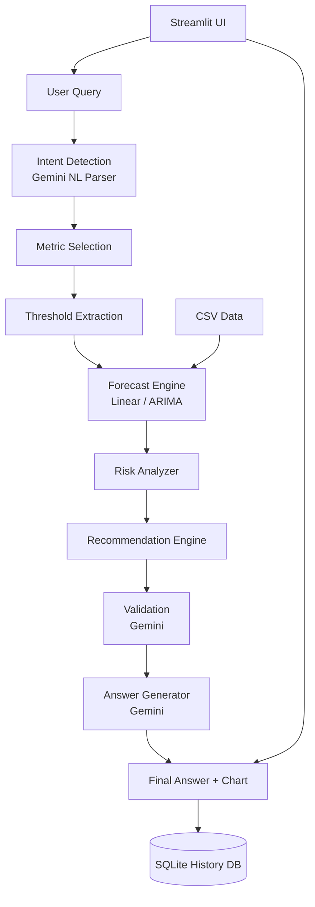

# AI Capacity Forecaster Agent

AI-powered infrastructure capacity planning system that replaces manual Excel-based forecasting with natural language queries, statistical forecasting, risk analysis, and actionable recommendations.
# Drive : 
https://drive.google.com/drive/folders/1q2NPVc1GJ3Rx_Z4nsL0txIY9OnJDxn-0?usp=drive_link
# Demo Video
https://www.loom.com/share/7907ceadc58b4c88932998222117ab7c

## Features

- **Natural Language Queries** — Ask questions like "When will disk usage hit 80%?" using Gemini API
- **Dual Forecasting Models** — Linear Regression and ARIMA(1,1,1)
- **Risk Analysis** — LOW / MEDIUM / HIGH / CRITICAL classification
- **What-If Scenarios** — Model accelerated growth (e.g., "CPU grows 20% faster")
- **Interactive Charts** — Plotly visualizations with historical data, forecasts, and threshold lines
- **Confidence Scoring** — Composite score based on model fit, data quality, and horizon
- **Business Recommendations** — Prioritized capacity expansion guidance
- **Query History** — SQLite persistence of all queries and results

## Architecture



### Agent Loop

```
Understand Query → Select Metric → Forecast → Validate → Generate Answer
```

| Module | Responsibility |
|--------|----------------|
| `agent/nl_parser.py` | Gemini-powered intent and parameter extraction |
| `agent/controller.py` | Orchestrates the full agent pipeline |
| `agent/risk_analyzer.py` | Risk level classification per metric |
| `agent/recommendation_engine.py` | Business recommendations |
| `agent/answer_generator.py` | Natural language final answers |
| `forecasting/linear_forecast.py` | sklearn Linear Regression |
| `forecasting/arima_forecast.py` | statsmodels ARIMA(1,1,1) |
| `forecasting/confidence.py` | Composite confidence scoring |
| `charts/plotter.py` | Plotly interactive charts |
| `database/db.py` | SQLite query history |

## Project Structure

```
capacity_forecaster/
├── app.py                          # Streamlit frontend
├── data/sample_metrics.csv         # Sample infrastructure metrics
├── agent/                          # AI agent modules
├── forecasting/                    # Forecast engines
├── charts/                         # Plotly visualizations
├── database/                       # SQLite persistence
├── utils/                          # Shared utilities
├── tests/                          # Pytest unit tests
├── prompts/                        # Gemini prompt templates
├── prompts.md                      # Prompt documentation
├── requirements.txt
├── .env                            # API keys (not committed)
└── README.md
```

## Setup Instructions

### Prerequisites

- Python 3.10+
- Gemini API key ([Google AI Studio](https://aistudio.google.com/apikey))

### Installation

```bash
cd capacity_forecaster
python -m venv venv

# Windows
venv\Scripts\activate

# macOS/Linux
source venv/bin/activate

pip install -r requirements.txt
```

### Configuration

Edit `.env` and set your Gemini API key:

```
GEMINI_API_KEY=your_actual_api_key_here
```

> The app works without an API key using rule-based parsing and template answers, but full AI capabilities require Gemini.

## Run Instructions

### Start the Streamlit App

```bash
streamlit run app.py
```

Open `http://localhost:8501` in your browser.

### Run Tests

```bash
pytest tests/ -v
```

## CSV Data Format

| Column | Type | Description |
|--------|------|-------------|
| `date` | Date (YYYY-MM-DD) | Observation date (monthly recommended) |
| `cpu_usage` | Float (0–100) | CPU utilization percentage |
| `memory_usage` | Float (0–100) | Memory utilization percentage |
| `disk_usage` | Float (0–100) | Disk utilization percentage |

Minimum 3 data points required. Column name aliases (e.g., `cpu`, `CPU %`) are auto-normalized.

## Sample Queries

| Query | What It Does |
|-------|--------------|
| `When will disk usage hit 80%?` | Predicts threshold crossing date for disk |
| `Forecast CPU usage for next 6 months.` | 6-month CPU projection with chart |
| `Which resource will exceed threshold first?` | Compares CPU, memory, disk crossing dates |
| `Show risk analysis for all resources.` | Full risk report with recommendations |
| `What if CPU grows 20% faster?` | What-if scenario with adjusted growth rate |

## Risk Levels

| Level | Utilization Range |
|-------|-------------------|
| LOW | 0–60% |
| MEDIUM | 60–80% |
| HIGH | 80–90% |
| CRITICAL | 90%+ |

## Assumptions

1. **Monthly granularity** — Data points represent monthly averages; forecasts use month-based offsets.
2. **Percentage metrics** — All utilization values are 0–100 percent.
3. **Linear trends** — Linear regression assumes approximately linear growth; suitable for steady-state infrastructure.
4. **ARIMA stationarity** — ARIMA(1,1,1) assumes differenced stationarity; works best with consistent seasonal patterns.
5. **Threshold defaults** — 80% threshold applied when not specified in query.
6. **Growth what-if** — "20% faster" scales the linear trend slope by 1.2×.
7. **Single environment** — Analysis covers one infrastructure environment per CSV upload.

## Limitations

1. **No seasonality modeling** — Neither model captures weekly/daily seasonal patterns explicitly.
2. **Short history** — Fewer than 12 data points reduce forecast reliability (reflected in confidence score).
3. **Gemini dependency** — Full NL understanding requires network access and valid API key.
4. **Univariate forecasts** — Each metric is forecast independently; cross-metric correlations are not modeled.
5. **Threshold extrapolation** — Crossing dates beyond the forecast horizon use linear extrapolation which may over/under-estimate.
6. **No anomaly detection** — Sudden spikes or outages in historical data are not filtered.
7. **CSV only** — No live integration with monitoring tools (Prometheus, CloudWatch, etc.) in this version.

## Example Output

```
Risk Level: HIGH

Recommendation:
Increase disk capacity by 30%
within next 45 days.

Confidence: High (78%)
```
